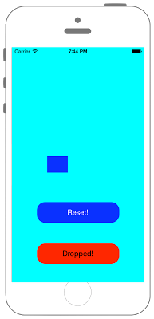
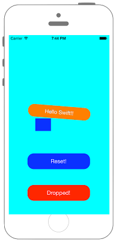

# UIWebViewでファイルの表示




## Swift3.0
```swift
//
//  ViewController.swift
//  UIKit065
//
//  Created by Misato Morino on 2016/08/15.
//  Copyright © 2016年 Misato Morino. All rights reserved.
//

import UIKit

class ViewController: UIViewController {
    
    // UIDynamicAnimatorはインスタンスを保存しなければアニメーションが実行されない.
    var animator : UIDynamicAnimator!
    
    var gravity : UIGravityBehavior!
    
    override func viewDidLoad() {
        
        super.viewDidLoad()
        
        self.view.backgroundColor = UIColor.cyan
        
        // Labelを作成.
        let myLabel: UILabel = UILabel(frame: CGRect(x: 0, y: 0, width: 200, height: 40))
        myLabel.backgroundColor = UIColor.orange
        myLabel.layer.masksToBounds = true
        myLabel.layer.cornerRadius = 20.0
        myLabel.text = "Hello Swift!!"
        myLabel.textColor = UIColor.white
        myLabel.shadowColor = UIColor.gray
        myLabel.textAlignment = NSTextAlignment.center
        myLabel.layer.position = CGPoint(x: self.view.bounds.width/2, y: -200)
        self.view.addSubview(myLabel)
        
        // 障害物を作成.
        let myBoxView = UIView(frame: CGRect(x: 0, y: 0, width: 50, height: 40))
        myBoxView.backgroundColor = UIColor.blue
        myBoxView.layer.masksToBounds = true
        myBoxView.layer.position = CGPoint(x: self.view.frame.midX - 50, y: self.view.frame.midY)
        self.view.addSubview(myBoxView)
        
        // DropButtonを作成.
        let myButton = UIButton(frame: CGRect(x: 0, y: 0, width: 200, height: 50))
        myButton.layer.position = CGPoint(x: self.view.frame.midX, y: 500)
        myButton.layer.masksToBounds = true
        myButton.layer.cornerRadius = 20.0
        myButton.setTitleColor(UIColor.white, for: UIControlState.normal)
        myButton.setTitleColor(UIColor.black, for: UIControlState.highlighted)
        myButton.backgroundColor = UIColor.red
        myButton.setTitle("Dropped!", for: UIControlState.normal)
        myButton.addTarget(self, action: #selector(ViewController.onClickMyButton(sender:)), for: UIControlEvents.touchUpInside)
        myButton.tag = 0
        self.view.addSubview(myButton)
        
        // ResetButtonを作成.
        let myResetButton = UIButton(frame: CGRect(x: 0, y: 0, width: 200, height: 50))
        myResetButton.layer.position = CGPoint(x: self.view.frame.midX, y: 400)
        myResetButton.layer.masksToBounds = true
        myResetButton.layer.cornerRadius = 20.0
        myResetButton.setTitleColor(UIColor.white, for: UIControlState.normal)
        myResetButton.setTitleColor(UIColor.black, for: UIControlState.highlighted)
        myResetButton.backgroundColor = UIColor.blue
        myResetButton.setTitle("Reset!", for: UIControlState.normal)
        myResetButton.addTarget(self, action: #selector(ViewController.onClickMyButton(sender:)), for: UIControlEvents.touchUpInside)
        myResetButton.tag = 1
        self.view.addSubview(myResetButton)
        
        // UIDynamiAnimatorの生成とインスタンスの保存.
        animator = UIDynamicAnimator(referenceView: self.view)
        
        // 重力を作り、Viewに適用させる.
        gravity = UIGravityBehavior(items: [myLabel])
        
        // Collisionを作成、Viewに適用させる.
        let collision = UICollisionBehavior(items: [myLabel,myBoxView])
        
        // Collisionの挙動を指定.
        collision.addBoundary(withIdentifier: "barrier", for: UIBezierPath(rect: myBoxView.frame))
        
        // Collisionのアニメーションを実行.
        animator.addBehavior(collision)
    }
    
    func onClickMyButton(sender : UIButton){
        
        switch(sender.tag) {
            
        // DropButton.
        case 0:
            // Gravityのアニメーションを実行.
            animator.addBehavior(gravity)
            
        // ResetButton.
        case 1:
            
            let next = ViewController()
            self.present(next, animated: false, completion: nil)
            
        default:
            print("error!")
        }
    }
}
```

## Swift 2.3
```swift
//
//  ViewController.swift
//  UIKit065
//
//  Created by Misato Morino on 2016/08/15.
//  Copyright © 2016年 Misato Morino. All rights reserved.
//

import UIKit

class ViewController: UIViewController {
    
    // UIDynamicAnimatorはインスタンスを保存しなければアニメーションが実行されない.
    var animator : UIDynamicAnimator!
    
    var gravity : UIGravityBehavior!
    
    override func viewDidLoad() {
        
        super.viewDidLoad()
        
        self.view.backgroundColor = UIColor.cyanColor()
        
        // Labelを作成.
        let myLabel: UILabel = UILabel(frame: CGRectMake(0,0,200,40))
        myLabel.backgroundColor = UIColor.orangeColor()
        myLabel.layer.masksToBounds = true
        myLabel.layer.cornerRadius = 20.0
        myLabel.text = "Hello Swift!!"
        myLabel.textColor = UIColor.whiteColor()
        myLabel.shadowColor = UIColor.grayColor()
        myLabel.textAlignment = NSTextAlignment.Center
        myLabel.layer.position = CGPoint(x: self.view.bounds.width/2,y: -200)
        self.view.addSubview(myLabel)
        
        // 障害物を作成.
        let myBoxView = UIView(frame: CGRectMake(0, 0, 50, 40))
        myBoxView.backgroundColor = UIColor.blueColor()
        myBoxView.layer.masksToBounds = true
        myBoxView.layer.position = CGPointMake(self.view.frame.midX - 50, self.view.frame.midY)
        self.view.addSubview(myBoxView)
        
        // DropButtonを作成.
        let myButton = UIButton(frame: CGRectMake(0, 0, 200, 50))
        myButton.layer.position = CGPointMake(self.view.frame.midX, 500)
        myButton.layer.masksToBounds = true
        myButton.layer.cornerRadius = 20.0
        myButton.setTitleColor(UIColor.whiteColor(), forState: UIControlState.Normal)
        myButton.setTitleColor(UIColor.blackColor(), forState: UIControlState.Highlighted)
        myButton.backgroundColor = UIColor.redColor()
        myButton.setTitle("Dropped!", forState: UIControlState.Normal)
        myButton.addTarget(self, action: #selector(ViewController.onClickMyButton(_:)), forControlEvents: UIControlEvents.TouchUpInside)
        myButton.tag = 0
        self.view.addSubview(myButton)
        
        // ResetButtonを作成.
        let myResetButton = UIButton(frame: CGRectMake(0, 0, 200, 50))
        myResetButton.layer.position = CGPointMake(self.view.frame.midX, 400)
        myResetButton.layer.masksToBounds = true
        myResetButton.layer.cornerRadius = 20.0
        myResetButton.setTitleColor(UIColor.whiteColor(), forState: UIControlState.Normal)
        myResetButton.setTitleColor(UIColor.blackColor(), forState: UIControlState.Highlighted)
        myResetButton.backgroundColor = UIColor.blueColor()
        myResetButton.setTitle("Reset!", forState: UIControlState.Normal)
        myResetButton.addTarget(self, action: #selector(ViewController.onClickMyButton(_:)), forControlEvents: UIControlEvents.TouchUpInside)
        myResetButton.tag = 1
        self.view.addSubview(myResetButton)
        
        // UIDynamiAnimatorの生成とインスタンスの保存.
        animator = UIDynamicAnimator(referenceView: self.view)
        
        // 重力を作り、Viewに適用させる.
        gravity = UIGravityBehavior(items: [myLabel])
        
        // Collisionを作成、Viewに適用させる.
        let collision = UICollisionBehavior(items: [myLabel,myBoxView])
        
        // Collisionの挙動を指定.
        collision.addBoundaryWithIdentifier("barrier", forPath: UIBezierPath(rect: myBoxView.frame))
        
        // Collisionのアニメーションを実行.
        animator.addBehavior(collision)
    }
    
    func onClickMyButton(sender : UIButton){
        
        switch(sender.tag) {
            
        // DropButton.
        case 0:
            // Gravityのアニメーションを実行.
            animator.addBehavior(gravity)
            
        // ResetButton.
        case 1:
            
            let next = ViewController()
            self.presentViewController(next, animated: false, completion: nil)
            
        default:
            print("error!")
        }
    }
}
```

## 2.3と3.0の差分

* CGRectMake, CGPointMakeが廃止

## Reference

* UIView
    * [https://developer.apple.com/reference/uikit/uiview](https://developer.apple.com/reference/uikit/uiview)
* UIGravityBehavior
    * [https://developer.apple.com/reference/uikit/uigravitybehavior](https://developer.apple.com/reference/uikit/uigravitybehavior)
* UICollisionBehavior
    * [https://developer.apple.com/reference/uikit/uicollisionbehavior](https://developer.apple.com/reference/uikit/uicollisionbehavior)
* UIDynamicAnimator
    * [https://developer.apple.com/reference/uikit/UIDynamicAnimator](https://developer.apple.com/reference/uikit/uidynamicanimator)
