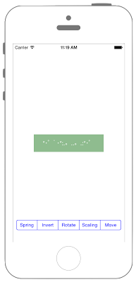

# UIViewアニメーションまとめ



## Swift3.0
```swift
//
//  ViewController.swift
//  UIKit069
//
//  Created by Misato Morino on 2016/08/15.
//  Copyright © 2016年 Misato Morino. All rights reserved.
//

import UIKit

class ViewController: UIViewController {
    
    var myLabel: UILabel!
    
    override func viewDidLoad() {
        super.viewDidLoad()
        
        // Labelを生成
        myLabel = UILabel(frame: CGRect(x: 0, y: 0, width: 200, height: 50))
        myLabel.backgroundColor = UIColor(red: 0.561, green: 0.737, blue: 0.561, alpha: 1.0)
        myLabel.center = self.view.center
        myLabel.text = "*･゜ﾟ･*:.｡..｡.:*･゜"
        myLabel.textAlignment = NSTextAlignment.center
        myLabel.textColor = UIColor.white
        
        // SegmentesControllerを生成.
        let mySegcon = UISegmentedControl(items: ["Spring", "Invert", "Rotate", "Scaling", "Move"])
        mySegcon.layer.position = CGPoint(x: self.view.frame.width/2, y: self.view.frame.height - 50)
        mySegcon.tintColor = UIColor.blue
        mySegcon.addTarget(self, action: #selector(ViewController.changedValue(sender:)), for: UIControlEvents.valueChanged)
        
        // Labelをviewに追加
        self.view.addSubview(myLabel)
        
        // SegmentedControllerをviewに追加.
        self.view.addSubview(mySegcon)
    }
    
    /*
     SegmentedControllerの値が変わった時に呼ばれるメソッド.
     */
    func changedValue(sender: UISegmentedControl) {
        
        myLabel.center = self.view.center
        
        // 各アニメーションの処理.
        switch(sender.selectedSegmentIndex) {
            
            /*
             バネのような動きをするアニメーション.
             */
        case 0:
            // アニメーションの時間を2秒に設定.
            UIView.animate(withDuration: 2.0,
                                       
                                       // 遅延時間.
                delay: 0.0,
                
                // バネの弾性力. 小さいほど弾性力は大きくなる.
                usingSpringWithDamping: 0.2,
                
                // 初速度.
                initialSpringVelocity: 1.5,
                
                // 一定の速度.
                options: UIViewAnimationOptions.curveLinear,
                
                animations: { () -> Void in
                    
                    self.myLabel.layer.position = CGPoint(x: self.view.frame.width-50, y: 100)
                    
                    // アニメーション完了時の処理
            }) { (Bool) -> Void in
                self.myLabel.center = self.view.center
            }
            
            /*
             X, Y方向にそれぞれ反転するアニメーション.
             */
        case 1:
            // アニメーションの時間を3秒に設定
            UIView.animate(withDuration: 3.0,
                                       
                                       // アニメーション中の処理
                animations: { () -> Void in
                    
                    // X方向に反転用のアフィン行列作成
                    self.myLabel.transform = self.myLabel.transform.scaledBy(x: -1.0, y: 1.0)
                    
                    // 連続したアニメーション処理.
            }) { (Bool) -> Void in
                UIView.animate(withDuration: 3.0,
                                           
                                           // アニメーション中の処理
                    animations: { () -> Void in
                        
                        // Y方向に反転用のアフィン行列作成
                        self.myLabel.transform = self.myLabel.transform.scaledBy(x: 1.0, y: -1.0)
                        
                        // アニメーション完了時の処理
                }) { (Bool) -> Void in
                }
            }
            
            /*
             回転アニメーション.
             */
        case 2:
            // 初期化.
            self.myLabel.transform = CGAffineTransform(rotationAngle: 0)
            
            // radianで回転角度を指定(90度).
            let angle:CGFloat = CGFloat(M_PI_2)
            
            // アニメーションの秒数を設定(3秒).
            UIView.animate(withDuration: 3.0,
                                       
                                       animations: { () -> Void in
                                        
                                        // 回転用のアフィン行列を生成.
                                        self.myLabel.transform = CGAffineTransform(rotationAngle: angle)
                },
                                       completion: { (Bool) -> Void in
            })
            
            /*
             拡縮アニメーション.
             */
        case 3:
            self.myLabel.transform = CGAffineTransform(scaleX: 1, y: 1)
            
            // アニメーションの時間を3秒に設定.
            UIView.animate(withDuration: 3.0,
                                       
                                       animations: { () -> Void in
                                        // 縮小用アフィン行列を作成.
                                        self.myLabel.transform = CGAffineTransform(scaleX: 1.5, y: 1.5)
                }) // 連続したアニメーション処理.
            { (Bool) -> Void in
                UIView.animate(withDuration: 3.0,
                                           // アニメーション中の処理.
                    animations: { () -> Void in
                        // 拡大用アフィン行列を作成.
                        self.myLabel.transform = CGAffineTransform(scaleX: 0.5, y: 0.5)
                    }) // アニメーション完了時の処理.
                { (Bool) -> Void in
                    // 大きさを元に戻す.
                    self.myLabel.transform = CGAffineTransform(scaleX: 1, y: 1)
                }
            }
            
            /*
             移動するアニメーション.
             */
        case 4:
            myLabel.layer.position = CGPoint(x: -30, y: -30)
            
            // アニメーション処理
            UIView.animate(withDuration: TimeInterval(CGFloat(3.0)),
                                       animations: {() -> Void in
                                        
                                        // 移動先の座標を指定する.
                                        self.myLabel.center = CGPoint(x: self.view.frame.width/2,y: self.view.frame.height/2);
                                        
                }, completion: {(Bool) -> Void in
            })
            
        default:
            print("error!")
        }
    }
    
    override func didReceiveMemoryWarning() {
        super.didReceiveMemoryWarning()
    }
} 
```

## Swift 2.3
```swift
//
//  ViewController.swift
//  UIKit069
//
//  Created by Misato Morino on 2016/08/15.
//  Copyright © 2016年 Misato Morino. All rights reserved.
//

import UIKit

class ViewController: UIViewController {
    
    var myLabel: UILabel!
    
    override func viewDidLoad() {
        super.viewDidLoad()
        
        // Labelを生成
        myLabel = UILabel(frame: CGRectMake(0, 0, 200, 50))
        myLabel.backgroundColor = UIColor(red: 0.561, green: 0.737, blue: 0.561, alpha: 1.0)
        myLabel.center = self.view.center
        myLabel.text = "*･゜ﾟ･*:.｡..｡.:*･゜"
        myLabel.textAlignment = NSTextAlignment.Center
        myLabel.textColor = UIColor.whiteColor()
        
        // SegmentesControllerを生成.
        let mySegcon = UISegmentedControl(items: ["Spring", "Invert", "Rotate", "Scaling", "Move"])
        mySegcon.layer.position = CGPointMake(self.view.frame.width/2, self.view.frame.height - 50)
        mySegcon.tintColor = UIColor.blueColor()
        mySegcon.addTarget(self, action: #selector(ViewController.changedValue(_:)), forControlEvents: UIControlEvents.ValueChanged)
        
        // Labelをviewに追加
        self.view.addSubview(myLabel)
        
        // SegmentedControllerをviewに追加.
        self.view.addSubview(mySegcon)
    }
    
    /*
     SegmentedControllerの値が変わった時に呼ばれるメソッド.
     */
    func changedValue(sender: UISegmentedControl) {
        
        myLabel.center = self.view.center
        
        // 各アニメーションの処理.
        switch(sender.selectedSegmentIndex) {
            
            /*
             バネのような動きをするアニメーション.
             */
        case 0:
            // アニメーションの時間を2秒に設定.
            UIView.animateWithDuration(2.0,
                                       
                                       // 遅延時間.
                delay: 0.0,
                
                // バネの弾性力. 小さいほど弾性力は大きくなる.
                usingSpringWithDamping: 0.2,
                
                // 初速度.
                initialSpringVelocity: 1.5,
                
                // 一定の速度.
                options: UIViewAnimationOptions.CurveLinear,
                
                animations: { () -> Void in
                    
                    self.myLabel.layer.position = CGPointMake(self.view.frame.width-50, 100)
                    
                    // アニメーション完了時の処理
            }) { (Bool) -> Void in
                self.myLabel.center = self.view.center
            }
            
            /*
             X, Y方向にそれぞれ反転するアニメーション.
             */
        case 1:
            // アニメーションの時間を3秒に設定
            UIView.animateWithDuration(3.0,
                                       
                                       // アニメーション中の処理
                animations: { () -> Void in
                    
                    // X方向に反転用のアフィン行列作成
                    self.myLabel.transform = CGAffineTransformScale(self.myLabel.transform, -1.0, 1.0)
                    
                    // 連続したアニメーション処理.
            }) { (Bool) -> Void in
                UIView.animateWithDuration(3.0,
                                           
                                           // アニメーション中の処理
                    animations: { () -> Void in
                        
                        // Y方向に反転用のアフィン行列作成
                        self.myLabel.transform = CGAffineTransformScale(self.myLabel.transform, 1.0, -1.0)
                        
                        // アニメーション完了時の処理
                }) { (Bool) -> Void in
                }
            }
            
            /*
             回転アニメーション.
             */
        case 2:
            // 初期化.
            self.myLabel.transform = CGAffineTransformMakeRotation(0)
            
            // radianで回転角度を指定(90度).
            let angle:CGFloat = CGFloat(M_PI_2)
            
            // アニメーションの秒数を設定(3秒).
            UIView.animateWithDuration(3.0,
                                       
                                       animations: { () -> Void in
                                        
                                        // 回転用のアフィン行列を生成.
                                        self.myLabel.transform = CGAffineTransformMakeRotation(angle)
                },
                                       completion: { (Bool) -> Void in
            })
            
            /*
             拡縮アニメーション.
             */
        case 3:
            self.myLabel.transform = CGAffineTransformMakeScale(1, 1)
            
            // アニメーションの時間を3秒に設定.
            UIView.animateWithDuration(3.0,
                                       
                                       animations: { () -> Void in
                                        // 縮小用アフィン行列を作成.
                                        self.myLabel.transform = CGAffineTransformMakeScale(1.5, 1.5)
                }) // 連続したアニメーション処理.
            { (Bool) -> Void in
                UIView.animateWithDuration(3.0,
                                           // アニメーション中の処理.
                    animations: { () -> Void in
                        // 拡大用アフィン行列を作成.
                        self.myLabel.transform = CGAffineTransformMakeScale(0.5, 0.5)
                    }) // アニメーション完了時の処理.
                { (Bool) -> Void in
                    // 大きさを元に戻す.
                    self.myLabel.transform = CGAffineTransformMakeScale(1, 1)
                }
            }
            
            /*
             移動するアニメーション.
             */
        case 4:
            myLabel.layer.position = CGPointMake(-30, -30)
            
            // アニメーション処理
            UIView.animateWithDuration(NSTimeInterval(CGFloat(3.0)),
                                       animations: {() -> Void in
                                        
                                        // 移動先の座標を指定する.
                                        self.myLabel.center = CGPoint(x: self.view.frame.width/2,y: self.view.frame.height/2);
                                        
                }, completion: {(Bool) -> Void in
            })
            
        default:
            print("error!")
        }
    }
    
    override func didReceiveMemoryWarning() {
        super.didReceiveMemoryWarning()
    }
}
```

## 2.3と3.0の差分

* CGPointMakeが廃止
* CGRectMakeが廃止

## Reference

* UIView
    * [https://developer.apple.com/reference/uikit/uiview](https://developer.apple.com/reference/uikit/uiview)
