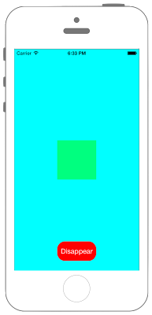

# UIWebViewでPDFを開く




## Swift3.0
```swift
//
//  ViewController.swift
//  UIKit074
//
//  Created by Misato Morino on 2016/08/15.
//  Copyright © 2016年 Misato Morino. All rights reserved.
//

import UIKit

class ViewController: UIViewController {
    
    var myView: UIView!
    var myButton: UIButton!
    var flag: Bool!
    
    override func viewDidLoad() {
        super.viewDidLoad()
        
        // view表示・非表示のためのフラグ.
        flag = false
        
        // viewの背景を青色に設定.
        self.view.backgroundColor = UIColor.cyan
        
        // Viewを生成.
        myView = UIView(frame: CGRect(x: 0, y: 0, width: 100, height: 100))
        
        // myViewの背景を緑色に設定.
        myView.backgroundColor = UIColor.green
        
        // 透明度を設定.
        myView.alpha = 0.5
        
        // 位置を中心に設定.
        myView.layer.position = CGPoint(x: self.view.frame.width/2, y: self.view.frame.height/2)
        
        // myViewを非表示.
        myView.isHidden = true
        
        // ボタンを生成.
        myButton = UIButton(frame: CGRect(x: 0, y: 0, width: 100, height: 50))
        myButton.backgroundColor = UIColor.red
        myButton.layer.cornerRadius = 20.0
        myButton.layer.position = CGPoint(x: self.view.frame.width/2, y: self.view.frame.height-50)
        myButton.setTitle("Appear", for: .normal)
        myButton.setTitleColor(UIColor.white, for: .normal)
        myButton.addTarget(self, action: #selector(ViewController.onClickMyButton(sender:)), for: .touchUpInside)
        
        // myViewをviewに追加.
        self.view.addSubview(myView)
        
        // ボタンをviewに追加.
        self.view.addSubview(myButton)
    }
    
    /*
     ボタンイベント
     */
    func onClickMyButton(sender: UIButton) {
        
        // flagがfalseならmyViewを表示.
        if !flag {
            // myViewを表示.
            myView.isHidden = false
            
            // ボタンのタイトルを変更.
            myButton.setTitle("Disappear", for: .normal)
            flag = true
        }
            // flagがtrueならmyViewを非表示.
        else {
            
            // myViewを非表示.
            myView.isHidden = true
            
            // ボタンのタイトルを変更.
            myButton.setTitle("Appear", for: .normal)
            flag = false
        }
    }
    
    override func didReceiveMemoryWarning() {
        super.didReceiveMemoryWarning()
    }
}
```

## Swift 2.3
```swift
//
//  ViewController.swift
//  UIKit073
//
//  Created by Misato Morino on 2016/08/15.
//  Copyright © 2016年 Misato Morino. All rights reserved.
//

import UIKit

class ViewController: UIViewController {
    
    var myView: UIView!
    var myButton: UIButton!
    var flag: Bool!
    
    override func viewDidLoad() {
        super.viewDidLoad()
        
        // view表示・非表示のためのフラグ.
        flag = false
        
        // viewの背景を青色に設定.
        self.view.backgroundColor = UIColor.cyanColor()
        
        // Viewを生成.
        myView = UIView(frame: CGRectMake(0, 0, 100, 100))
        
        // myViewの背景を緑色に設定.
        myView.backgroundColor = UIColor.greenColor()
        
        // 透明度を設定.
        myView.alpha = 0.5
        
        // 位置を中心に設定.
        myView.layer.position = CGPointMake(self.view.frame.width/2, self.view.frame.height/2)
        
        // myViewを非表示.
        myView.hidden = true
        
        // ボタンを生成.
        myButton = UIButton(frame: CGRectMake(0, 0, 100, 50))
        myButton.backgroundColor = UIColor.redColor()
        myButton.layer.cornerRadius = 20.0
        myButton.layer.position = CGPointMake(self.view.frame.width/2, self.view.frame.height-50)
        myButton.setTitle("Appear", forState: .Normal)
        myButton.setTitleColor(UIColor.whiteColor(), forState: .Normal)
        myButton.addTarget(self, action: #selector(ViewController.onClickMyButton(_:)), forControlEvents: .TouchUpInside)
        
        // myViewをviewに追加.
        self.view.addSubview(myView)
        
        // ボタンをviewに追加.
        self.view.addSubview(myButton)
    }
    
    /*
     ボタンイベント
     */
    func onClickMyButton(sender: UIButton) {
        
        // flagがfalseならmyViewを表示.
        if !flag {
            // myViewを表示.
            myView.hidden = false
            
            // ボタンのタイトルを変更.
            myButton.setTitle("Disappear", forState: .Normal)
            flag = true
        }
            // flagがtrueならmyViewを非表示.
        else {
            
            // myViewを非表示.
            myView.hidden = true
            
            // ボタンのタイトルを変更.
            myButton.setTitle("Appear", forState: .Normal)
            flag = false
        }
    }
    
    override func didReceiveMemoryWarning() {
        super.didReceiveMemoryWarning()
    }
}
```

## 2.3と3.0の差分

* ```#selector(ViewController.onClickMyButton(_:))``` から ```#selector(ViewController.onClickMyButton(sender:))``` に変更

## Reference

* UIButton
    * [https://developer.apple.com/reference/uikit/uibutton](https://developer.apple.com/reference/uikit/uibutton)
* UIView
    * [https://developer.apple.com/reference/uikit/uiview](https://developer.apple.com/reference/uikit/uiview)
