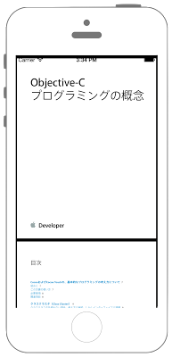

# UIWebViewでPDFを開く



## Swift3.0
```swift
//
//  ViewController.swift
//  swiftdocs
//
//  Created by Misato Morino on 2016/08/15.
//  Copyright © 2016年 Misato Morino. All rights reserved.
//

import UIKit

class ViewController: UIViewController, UIWebViewDelegate {
    
    var myWebView: UIWebView!
    var myPDFurl: NSURL!
    var myRequest: NSURLRequest!
    var myIndiator: UIActivityIndicatorView!
    
    override func viewDidLoad() {
        super.viewDidLoad()
        
        // Buttonを生成.
        let myButton: UIButton = UIButton(frame: CGRect(x: 0, y: 0, width: 200, height: 50))
        myButton.layer.cornerRadius = 20.0
        myButton.layer.masksToBounds = true
        myButton.layer.position = CGPoint(x: self.view.frame.width/2, y: self.view.frame.height - 50)
        myButton.backgroundColor = UIColor.orange
        myButton.setTitle("Open PDF", for: UIControlState.normal)
        myButton.setTitleColor(UIColor.white, for: UIControlState.normal)
        myButton.addTarget(self, action: #selector(ViewController.onClickMyButton(sender:)), for: UIControlEvents.touchUpInside)
        self.view.addSubview(myButton)
        
        // PDFを開くためのWebViewを生成.
        myWebView = UIWebView(frame: CGRect(x: 0, y: 0, width: self.view.frame.width, height: self.view.frame.height))
        myWebView.delegate = self
        myWebView.scalesPageToFit = true
        myWebView.layer.position = CGPoint(x: self.view.frame.width/2, y: self.view.frame.height/2)
        
        // URLReqestを生成.
        myPDFurl = NSURL(string: "https://developer.apple.com/jp/documentation/CocoaEncyclopedia.pdf")!
        myRequest = NSURLRequest(url: myPDFurl as URL)
        
        // ページ読み込み中に表示させるインジケータを生成.
        myIndiator = UIActivityIndicatorView(frame: CGRect(x: 0, y: 0, width: 50, height: 50))
        myIndiator.center = self.view.center
        myIndiator.hidesWhenStopped = true
        myIndiator.activityIndicatorViewStyle = UIActivityIndicatorViewStyle.gray
    }
    
    /*
     インジケータのアニメーション開始.
     */
    func startAnimation() {
        
        // NetworkActivityIndicatorを表示.
        UIApplication.shared.isNetworkActivityIndicatorVisible = true
        
        // UIACtivityIndicatorを表示.
        if !myIndiator.isAnimating {
            myIndiator.startAnimating()
        }
        
        // viewにインジケータを追加.
        self.view.addSubview(myIndiator)
    }
    
    /*
     インジケータのアニメーション終了.
     */
    func stopAnimation() {
        // NetworkActivityIndicatorを非表示.
        UIApplication.shared.isNetworkActivityIndicatorVisible = false
        
        // UIACtivityIndicatorを非表示.
        if myIndiator.isAnimating {
            myIndiator.stopAnimating()
        }
    }
    
    /*
     Buttonが押された時に呼ばれるメソッド.
     */
    func onClickMyButton(sender: UIButton) {
        
        // WebViewのLoad開始.
        myWebView.loadRequest(myRequest as URLRequest)
        
        // viewにWebViewを追加.
        self.view.addSubview(myWebView)
    }
    
    /*
     WebViewのloadが開始された時に呼ばれるメソッド.
     */
    func webViewDidStartLoad(_ webView: UIWebView) {
        print("load started")
        
        startAnimation()
    }
    
    /*
     WebViewのloadが終了した時に呼ばれるメソッド.
     */
    func webViewDidFinishLoad(_ webView: UIWebView) {
        print("load finished")
        
        stopAnimation()
    }
    
    override func didReceiveMemoryWarning() {
        super.didReceiveMemoryWarning()
    }
}
```

## Swift 2.3
```swift
//
//  ViewController.swift
//  UIKit074
//
//  Created by Misato Morino on 2016/08/15.
//  Copyright © 2016年 Misato Morino. All rights reserved.
//

import UIKit

class ViewController: UIViewController, UIWebViewDelegate {
    
    var myWebView: UIWebView!
    var myPDFurl: NSURL!
    var myRequest: NSURLRequest!
    var myIndiator: UIActivityIndicatorView!
    
    override func viewDidLoad() {
        super.viewDidLoad()
        
        // Buttonを生成.
        let myButton: UIButton = UIButton(frame: CGRectMake(0, 0, 200, 50))
        myButton.layer.cornerRadius = 20.0
        myButton.layer.masksToBounds = true
        myButton.layer.position = CGPointMake(self.view.frame.width/2, self.view.frame.height - 50)
        myButton.backgroundColor = UIColor.orangeColor()
        myButton.setTitle("Open PDF", forState: UIControlState.Normal)
        myButton.setTitleColor(UIColor.whiteColor(), forState: UIControlState.Normal)
        myButton.addTarget(self, action: #selector(ViewController.onClickMyButton(_:)), forControlEvents: UIControlEvents.TouchUpInside)
        self.view.addSubview(myButton)
        
        // PDFを開くためのWebViewを生成.
        myWebView = UIWebView(frame: CGRectMake(0, 0, self.view.frame.width, self.view.frame.height))
        myWebView.delegate = self
        myWebView.scalesPageToFit = true
        myWebView.layer.position = CGPointMake(self.view.frame.width/2, self.view.frame.height/2)
        
        // URLReqestを生成.
        myPDFurl = NSURL(string: "https://developer.apple.com/jp/documentation/CocoaEncyclopedia.pdf")!
        myRequest = NSURLRequest(URL: myPDFurl)
        
        // ページ読み込み中に表示させるインジケータを生成.
        myIndiator = UIActivityIndicatorView(frame: CGRectMake(0, 0, 50, 50))
        myIndiator.center = self.view.center
        myIndiator.hidesWhenStopped = true
        myIndiator.activityIndicatorViewStyle = UIActivityIndicatorViewStyle.Gray
    }
    
    /*
     インジケータのアニメーション開始.
     */
    func startAnimation() {
        
        // NetworkActivityIndicatorを表示.
        UIApplication.sharedApplication().networkActivityIndicatorVisible = true
        
        // UIACtivityIndicatorを表示.
        if !myIndiator.isAnimating() {
            myIndiator.startAnimating()
        }
        
        // viewにインジケータを追加.
        self.view.addSubview(myIndiator)
    }
    
    /*
     インジケータのアニメーション終了.
     */
    func stopAnimation() {
        // NetworkActivityIndicatorを非表示.
        UIApplication.sharedApplication().networkActivityIndicatorVisible = false
        
        // UIACtivityIndicatorを非表示.
        if myIndiator.isAnimating() {
            myIndiator.stopAnimating()
        }
    }
    
    /*
     Buttonが押された時に呼ばれるメソッド.
     */
    func onClickMyButton(sender: UIButton) {
        
        // WebViewのLoad開始.
        myWebView.loadRequest(myRequest)
        
        // viewにWebViewを追加.
        self.view.addSubview(myWebView)
    }
    
    /*
     WebViewのloadが開始された時に呼ばれるメソッド.
     */
    func webViewDidStartLoad(webView: UIWebView) {
        print("load started")
        
        startAnimation()
    }
    
    /*
     WebViewのloadが終了した時に呼ばれるメソッド.
     */
    func webViewDidFinishLoad(webView: UIWebView) {
        print("load finished")
        
        stopAnimation()
    }
    
    override func didReceiveMemoryWarning() {
        super.didReceiveMemoryWarning()
    }
}
```

## 2.3と3.0の差分

* ```#selector(ViewController.onClickMyButton(_:))``` から ```#selector(ViewController.onClickMyButton(sender:))``` に変更

## Reference

* UIWebView
    * [https://developer.apple.com/reference/uikit/uiwebview](https://developer.apple.com/reference/uikit/uiwebview)
* UIButton
    * [https://developer.apple.com/reference/uikit/uibutton](https://developer.apple.com/reference/uikit/uibutton)
* UIActivityIndicatorView
    * [https://developer.apple.com/reference/uikit/uiactivityindicatorview](https://developer.apple.com/reference/uikit/uiactivityindicatorview)
* NSURL
    * [https://developer.apple.com/reference/foundation/nsurl](https://developer.apple.com/reference/foundation/nsurl)
* NSURLRequest
    * [https://developer.apple.com/reference/foundation/nsurlrequest](https://developer.apple.com/reference/foundation/nsurlrequest)
