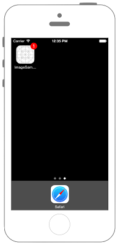
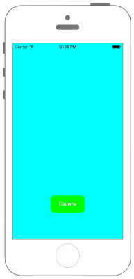

# アプリのアイコンにバッジを表示する




## Swift3.0
```swift
//
//  ViewController.swift
//  Utility000_3.0
//
//  Created by KimikoWatanabe on 2016/08/22.
//  Copyright © 2016年 FaBo, Inc. All rights reserved.
//

import UIKit
import UserNotifications

class ViewController: UIViewController,UIApplicationDelegate {

    override func viewDidLoad() {
        super.viewDidLoad()

        self.view.backgroundColor = UIColor.cyan

        //ボタンを生成.
        let myButton = UIButton()
        myButton.frame = CGRect(x:0, y:0, width:100, height:50)
        myButton.backgroundColor = UIColor.green
        myButton.setTitle("Delete", for: .normal)
        myButton.setTitleColor(UIColor.white, for: .normal)
        myButton.layer.masksToBounds = true
        myButton.layer.cornerRadius = 10.0
        myButton.layer.position = CGPoint(x:self.view.frame.width/2, y:self.view.frame.height-100)
        myButton.addTarget(self, action: #selector(ViewController.onClickMyButton(sender:)), for: .touchUpInside)
        self.view.addSubview(myButton)


        let center:UNUserNotificationCenter = UNUserNotificationCenter.current()
        center.requestAuthorization(options: [.badge], completionHandler: {(permit, error) in

            if permit {
                print("通知が許可されました")
            }else {
                print("通知が拒否されました")
            }

            //バッジの数の設定.
            UIApplication.shared.applicationIconBadgeNumber = 1

        })
    }

    //ボタンイベント.
    func onClickMyButton(sender: UIButton){

        //バッジの数を０にする.
        UIApplication.shared.applicationIconBadgeNumber = 0

    }

}
```

## Swift 2.3
```swift
//
//  ViewController.swift
//  Utility000_2.3
//
//  Created by KimikoWatanabe on 2016/08/22.
//  Copyright © 2016年 FaBo, Inc. All rights reserved.
//

import UIKit

class ViewController: UIViewController,UIApplicationDelegate {

    override func viewDidLoad() {
        super.viewDidLoad()

        self.view.backgroundColor = UIColor.cyanColor()

        //ボタンを生成.
        let myButton = UIButton()
        myButton.frame = CGRectMake(0, 0, 100, 50)
        myButton.backgroundColor = UIColor.greenColor()
        myButton.setTitle("Delete", forState: .Normal)
        myButton.setTitleColor(UIColor.whiteColor(), forState: .Normal)
        myButton.layer.masksToBounds = true
        myButton.layer.cornerRadius = 10.0
        myButton.layer.position = CGPointMake(self.view.frame.width/2, self.view.frame.height-100)
        myButton.addTarget(self, action: #selector(ViewController.onClickMyButton(_:)), forControlEvents: .TouchUpInside)
        self.view.addSubview(myButton)

        //permissionの設定.
        let settings = UIUserNotificationSettings(forTypes: UIUserNotificationType.Badge, categories: nil)
        UIApplication.sharedApplication().registerUserNotificationSettings(settings)

        //バッジの数の設定.
        UIApplication.sharedApplication().applicationIconBadgeNumber = 1

    }

    //ボタンイベント.
    func onClickMyButton(sender: UIButton){

        //バッジの数を０にする.
        UIApplication.sharedApplication().applicationIconBadgeNumber = 0

    }

}
```

## 2.3と3.0の差分
* UIColorの参照方法が変更(UIColor.grayColor()->UIColor.gray)
* CGRect,CGPointの初期化方法の変更(CGRectMake,CGPointMakeの廃止)
* ```UIApplication.sharedApplication()```が```UIApplication.shared```に変更

## Reference
* UNUserNotificationCenter Class
 * [https://developer.apple.com/reference/usernotifications/unusernotificationcenter](https://developer.apple.com/reference/usernotifications/unusernotificationcenter)
* UIApplication Class
 * [https://developer.apple.com/reference/uikit/uiapplication](https://developer.apple.com/reference/uikit/uiapplication)
