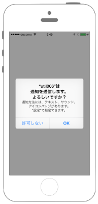

# 通知設定のダイアログ設定を開く



## Swift3.0
```swift
//
//  ViewController.swift
//  Utility006_3.0
//
//  Created by KimikoWatanabe on 2016/08/24.
//  Copyright © 2016年 FaBo, Inc. All rights reserved.
//


```

## Swift 2.3
```swift
//
//  ViewController.swift
//  Utility006_2.3
//
//  Created by KimikoWatanabe on 2016/08/24.
//  Copyright © 2016年 FaBo, Inc. All rights reserved.
//
```

## 2.3と3.0の差分
* UIColorの参照方法が変更(UIColor.grayColor()->UIColor.gray)
* CGRect,CGPointの初期化方法の変更(CGRectMake,CGPointMakeの廃止)

## Reference
* UIUserNotificationSettings Class
* UIApplication Class
