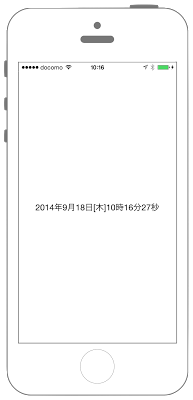

#現在時間の取得



## Swift3.0
```swift
//
//  ViewController.swift
//  Utility008_3.0
//
//  Created by KimikoWatanabe on 2016/08/24.
//  Copyright © 2016年 FaBo, Inc. All rights reserved.
//

import UIKit

class ViewController: UIViewController {

    override func viewDidLoad() {
        super.viewDidLoad()

        //現在時刻を取得.
        let myDate: Date = Date()

        //カレンダーを取得.
        let myCalendar: NSCalendar = NSCalendar(calendarIdentifier: NSCalendar.Identifier.gregorian)!

        //取得するコンポーネントを決める.
        let myComponetns = myCalendar.components(
            [
                NSCalendar.Unit.year,
                NSCalendar.Unit.month,
                NSCalendar.Unit.day,
                NSCalendar.Unit.hour,
                NSCalendar.Unit.minute,
                NSCalendar.Unit.second,
                NSCalendar.Unit.weekday
            ],from: myDate)

        let weekdayStrings: Array = ["nil","日","月","火","水","木","金","土","日"]

        print("year: \(myComponetns.year)")
        print("month: \(myComponetns.month)")
        print("day: \(myComponetns.day)")
        print("hour: \(myComponetns.hour)")
        print("minute: \(myComponetns.minute)")
        print("second: \(myComponetns.second)")
        print("weekday: \(weekdayStrings[myComponetns.weekday!])")

        //現在時間表示用のラベルを生成.
        let myLabel: UILabel = UILabel()
        myLabel.font = UIFont(name: "HiraKakuInterface-W1", size:UIFont.labelFontSize)

        var myStr: String = "\(myComponetns.year!)年"
        myStr += "\(myComponetns.month!)月"
        myStr += "\(myComponetns.day!)日["
        myStr += "\(weekdayStrings[myComponetns.weekday!])]"
        myStr += "\(myComponetns.hour!)時"
        myStr += "\(myComponetns.minute!)分"
        myStr += "\(myComponetns.second!)秒"

        myLabel.text = myStr
        myLabel.frame = CGRect(x: 0, y: self.view.bounds.height/2, width: self.view.bounds.width, height: 20)
        myLabel.textAlignment = NSTextAlignment.center
        self.view.addSubview(myLabel)

    }

}
```

## Swift 2.3
```swift
//
//  ViewController.swift
//  Utility008_2.3
//
//  Created by KimikoWatanabe on 2016/08/24.
//  Copyright © 2016年 FaBo, Inc. All rights reserved.
//

import UIKit

class ViewController: UIViewController {

    override func viewDidLoad() {
        super.viewDidLoad()

        //現在時刻を取得.
        let myDate: NSDate = NSDate()

        //カレンダーを取得.
        let myCalendar: NSCalendar = NSCalendar(calendarIdentifier: NSCalendarIdentifierGregorian)!

        //取得するコンポーネントを決める.
        let myComponetns = myCalendar.components(
            [
                NSCalendarUnit.Year,
                NSCalendarUnit.Month,
                NSCalendarUnit.Day,
                NSCalendarUnit.Hour,
                NSCalendarUnit.Minute,
                NSCalendarUnit.Second,
                NSCalendarUnit.Weekday
            ],fromDate: myDate)

        let weekdayStrings: Array = ["nil","日","月","火","水","木","金","土","日"]

        print("year: \(myComponetns.year)")
        print("month: \(myComponetns.month)")
        print("day: \(myComponetns.day)")
        print("hour: \(myComponetns.hour)")
        print("minute: \(myComponetns.minute)")
        print("second: \(myComponetns.second)")
        print("weekday: \(weekdayStrings[myComponetns.weekday])")

        //現在時間表示用のラベルを生成.
        let myLabel: UILabel = UILabel()
        myLabel.font = UIFont(name: "HiraKakuInterface-W1", size:UIFont.labelFontSize())

        var myStr: String = "\(myComponetns.year)年"
        myStr += "\(myComponetns.month)月"
        myStr += "\(myComponetns.day)日["
        myStr += "\(weekdayStrings[myComponetns.weekday])]"
        myStr += "\(myComponetns.hour)時"
        myStr += "\(myComponetns.minute)分"
        myStr += "\(myComponetns.second)秒"

        myLabel.text = myStr
        myLabel.frame = CGRect(x: 0, y: self.view.bounds.height/2, width: self.view.bounds.width, height: 20)
        myLabel.textAlignment = NSTextAlignment.Center
        self.view.addSubview(myLabel)

    }

}
```

## 2.3と3.0の差分
* UIColorの参照方法が変更(UIColor.grayColor()->UIColor.gray)
* CGRect,CGPointの初期化方法の変更(CGRectMake,CGPointMakeの廃止)
* NSDateが廃止、Dateに変更
* ```NSCalendarIdentifierGregorian```が```NSCalendar.Identifier.gregorian```に変更
* ```NSCalendarUnit```が```NSCalendar.Unit```に変更

## Reference
* NSDate Class
* NSCalendar Class
