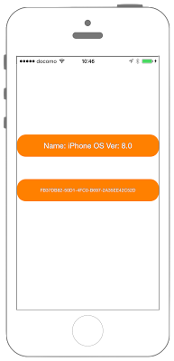

# OS情報の取得



## Swift3.0
```swift
//
//  ViewController.swift
//  Utility009_3.0
//
//  Created by KimikoWatanabe on 2016/08/24.
//  Copyright © 2016年 FaBo, Inc. All rights reserved.
//

import UIKit
import AdSupport
class ViewController: UIViewController {

    override func viewDidLoad() {
        super.viewDidLoad()

        // Labelを作成.
        let mySystemLabel: UILabel = UILabel(frame: CGRect(x:0,y:0,width:self.view.bounds.width,height:50))
        mySystemLabel.backgroundColor = UIColor.orange
        mySystemLabel.layer.masksToBounds = true
        mySystemLabel.layer.cornerRadius = 20.0
        mySystemLabel.textColor = UIColor.white
        mySystemLabel.shadowColor = UIColor.gray
        mySystemLabel.textAlignment = NSTextAlignment.center
        mySystemLabel.layer.position = CGPoint(x: self.view.bounds.width/2,y: 200)
        self.view.addSubview(mySystemLabel)

        // OS Version.
        let mySystemName = UIDevice.current.systemName
        let mySystemVersion = UIDevice.current.systemVersion

        print("Name: \(mySystemName)")
        print("Version: \(mySystemVersion)")

        mySystemLabel.text = "Name: \(mySystemName) Ver: \(mySystemVersion)"

        // ID for Vender.
        let myIDforVender = UIDevice.current.identifierForVendor

        // ID for Ad.
        let myASManager = ASIdentifierManager()
        let myIDforAd = myASManager.advertisingIdentifier

        print("myIDforAd :\(myIDforAd!.uuidString.utf8)")


        // Labelを作成.
        let myASManagerLabel: UILabel = UILabel(frame: CGRect(x:0,y:0,width:self.view.bounds.width,height:50))
        myASManagerLabel.backgroundColor = UIColor.orange
        myASManagerLabel.layer.masksToBounds = true
        myASManagerLabel.layer.cornerRadius = 20.0
        myASManagerLabel.textColor = UIColor.white
        myASManagerLabel.font = UIFont.systemFont(ofSize: CGFloat(10))
        myASManagerLabel.shadowColor = UIColor.gray
        myASManagerLabel.textAlignment = NSTextAlignment.center
        myASManagerLabel.layer.position = CGPoint(x: self.view.bounds.width/2,y: 300)
        self.view.addSubview(myASManagerLabel)

        myASManagerLabel.text = "\(myIDforAd!.uuidString)"
    }

}
```

## Swift 2.3
```swift
//
//  ViewController.swift
//  Utility009_2.3
//
//  Created by KimikoWatanabe on 2016/08/24.
//  Copyright © 2016年 FaBo, Inc. All rights reserved.
//

import UIKit
import AdSupport
class ViewController: UIViewController {

    override func viewDidLoad() {
        super.viewDidLoad()

        // Labelを作成.
        let mySystemLabel: UILabel = UILabel(frame: CGRectMake(0,0,self.view.bounds.width,50))
        mySystemLabel.backgroundColor = UIColor.orangeColor()
        mySystemLabel.layer.masksToBounds = true
        mySystemLabel.layer.cornerRadius = 20.0
        mySystemLabel.textColor = UIColor.whiteColor()
        mySystemLabel.shadowColor = UIColor.grayColor()
        mySystemLabel.textAlignment = NSTextAlignment.Center
        mySystemLabel.layer.position = CGPoint(x: self.view.bounds.width/2,y: 200)
        self.view.addSubview(mySystemLabel)

        // OS Version.
        let mySystemName = UIDevice.currentDevice().systemName
        let mySystemVersion = UIDevice.currentDevice().systemVersion

        print("Name: \(mySystemName)")
        print("Version: \(mySystemVersion)")

        mySystemLabel.text = "Name: \(mySystemName) Ver: \(mySystemVersion)"

        // ID for Vender.
        let myIDforVender = UIDevice.currentDevice().identifierForVendor

        // ID for Ad.
        let myASManager = ASIdentifierManager()
        let myIDforAd = myASManager.advertisingIdentifier

        print("myIDforAd :\(myIDforAd.UUIDString.utf8)")


        // Labelを作成.
        let myASManagerLabel: UILabel = UILabel(frame: CGRectMake(0,0,self.view.bounds.width,50))
        myASManagerLabel.backgroundColor = UIColor.orangeColor()
        myASManagerLabel.layer.masksToBounds = true
        myASManagerLabel.layer.cornerRadius = 20.0
        myASManagerLabel.textColor = UIColor.whiteColor()
        myASManagerLabel.font = UIFont.systemFontOfSize(CGFloat(10))
        myASManagerLabel.shadowColor = UIColor.grayColor()
        myASManagerLabel.textAlignment = NSTextAlignment.Center
        myASManagerLabel.layer.position = CGPoint(x: self.view.bounds.width/2,y: 300)
        self.view.addSubview(myASManagerLabel)

        myASManagerLabel.text = "\(myIDforAd.UUIDString.utf8)"
    }

}

```

## 2.3と3.0の差分
* UIColorの参照方法が変更(UIColor.grayColor()->UIColor.gray)
* CGRect,CGPointの初期化方法の変更(CGRectMake,CGPointMakeの廃止)
* ```UIDevice.currentDevice()```が```UIDevice.current```に変更

## Reference
* UIDevice Class
 * [https://developer.apple.com/reference/uikit/uidevice](https://developer.apple.com/reference/uikit/uidevice)
* ASIdentifierManager Class
 * [https://developer.apple.com/reference/adsupport/asidentifiermanager](https://developer.apple.com/reference/adsupport/asidentifiermanager)
