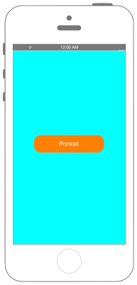
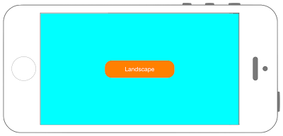

# 端末の向きが変わったことを検知する




## Swift3.0
```swift
//
//  ViewController.swift
//  Utility010_3.0
//
//  Created by KimikoWatanabe on 2016/08/24.
//  Copyright © 2016年 FaBo, Inc. All rights reserved.
//


```

## Swift 2.3
```swift
//
//  ViewController.swift
//  Utility010_2.3
//
//  Created by KimikoWatanabe on 2016/08/24.
//  Copyright © 2016年 FaBo, Inc. All rights reserved.
//

import UIKit

class ViewController: UIViewController {

    //端末の向き表示用のラベル.
    var myLabel:UILabel!

    override func viewDidLoad() {
        super.viewDidLoad()

        self.view.backgroundColor = UIColor.cyanColor()

        //現在の向きを表示するためのラベル.
        myLabel = UILabel(frame: CGRectMake(0, 0, 200, 50))
        myLabel.backgroundColor = UIColor.orangeColor()
        myLabel.textColor = UIColor.whiteColor()
        myLabel.layer.masksToBounds = true
        myLabel.layer.cornerRadius = 20.0
        myLabel.textAlignment = NSTextAlignment.Center
        myLabel.layer.position = CGPoint(x: self.view.frame.width/2, y: self.view.frame.height/2)
        myLabel.text = "Portrait"

        self.view.addSubview(myLabel)

    }

    override func viewDidAppear(animated: Bool) {

        // 端末の向きがかわったらNotificationを呼ばす設定.
        NSNotificationCenter.defaultCenter().addObserver(self, selector: #selector(ViewController.onOrientationChange(_:)), name: UIDeviceOrientationDidChangeNotification, object: nil)
    }

    // 端末の向きがかわったら呼び出される.
    func onOrientationChange(notification: NSNotification){

        // 現在のデバイスの向きを取得.
        let deviceOrientation: UIDeviceOrientation!  = UIDevice.currentDevice().orientation

        // 向きの判定.
        if UIDeviceOrientationIsLandscape(deviceOrientation) {

            //横向きの判定.
            //向きに従って位置を調整する.
            myLabel.layer.position = CGPoint(x: self.view.frame.width/2, y: self.view.frame.height/2)
            myLabel.text = "Landscape"

        } else if UIDeviceOrientationIsPortrait(deviceOrientation){

            //縦向きの判定.
            //向きに従って位置を調整する.
            myLabel.layer.position = CGPoint(x: self.view.frame.width/2, y: self.view.frame.height/2)
            myLabel.text = "Portrait"

        }

    }

}
```

## 2.3と3.0の差分
* UIColorの参照方法が変更(UIColor.grayColor()->UIColor.gray)
* CGRect,CGPointの初期化方法の変更(CGRectMake,CGPointMakeの廃止)

## Reference
* NSNotificationCenter Class
* UIDevice Class
