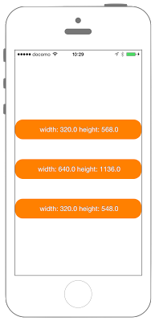

# 画面サイズを取得する



## Swift3.0
```swift
//
//  ViewController.swift
//  Utility011_3.0
//
//  Created by KimikoWatanabe on 2016/08/24.
//  Copyright © 2016年 FaBo, Inc. All rights reserved.
//

import UIKit

class ViewController: UIViewController {

    var myLabel: UILabel!

    override func viewDidLoad() {
        super.viewDidLoad()

        // Windowの表示領域すべてのサイズ(point).
        let myBoundSize: CGSize = UIScreen.main.bounds.size
        let myBoundSizeStr: NSString = "Bounds width: \(myBoundSize.width) height: \(myBoundSize.height)"
        print("\(myBoundSizeStr)")
        setMyLabel(text: myBoundSizeStr, point: CGPoint(x: 0, y: 100))

        // Windowの表示領域すべてのサイズ(pixel).
        let myNativeBoundSize: CGSize = UIScreen.main.nativeBounds.size
        let myNativeBoundSizeStr: NSString = "NativeBounds width: \(myNativeBoundSize.width) \nNativeBoundheight: \(myNativeBoundSize.height)"
        print("\(myNativeBoundSizeStr)")
        setMyLabel(text: myNativeBoundSizeStr, point: CGPoint(x: 0, y: 200))
        myLabel.font = UIFont.systemFont(ofSize: 14)

        // Windowの表示領域すべてのサイズ(pixel).
        let myAppFrameSize: CGSize = UIScreen.main.bounds.size
        let myAppFrameSizeStr: NSString = "applicationFrame width: \(myAppFrameSize.width) \nNativeBoundheight: \(myAppFrameSize.height)"
        print("\(myAppFrameSizeStr)")
        setMyLabel(text: myAppFrameSizeStr, point: CGPoint(x: 0, y: 300))
        myLabel.font = UIFont.systemFont(ofSize: 14)

        // WindowのScale.
        let myScale: CGFloat = UIScreen.main.scale
        print("\(myScale)")
        setMyLabel(text: "\(myScale)", point: CGPoint(x: 0, y: 400))
        myLabel.font = UIFont.systemFont(ofSize: 20)
    }

    // ラベルの表示.
    func setMyLabel(text: NSString, point: CGPoint){
        myLabel = UILabel(frame: CGRect(x:point.x,y:point.y,width:self.view.bounds.width,height:50))
        myLabel.backgroundColor = UIColor.orange
        myLabel.layer.masksToBounds = true
        myLabel.layer.cornerRadius = 10.0
        myLabel.textColor = UIColor.white
        myLabel.shadowColor = UIColor.gray
        myLabel.textAlignment = NSTextAlignment.center
        myLabel.text = text as String
        myLabel.numberOfLines = 2
        self.view.addSubview(myLabel)
    }

}
```

## Swift 2.3
```swift
//
//  ViewController.swift
//  Utility011_2.3
//
//  Created by KimikoWatanabe on 2016/08/24.
//  Copyright © 2016年 FaBo, Inc. All rights reserved.
//

import UIKit

class ViewController: UIViewController {

    var myLabel: UILabel!

    override func viewDidLoad() {
        super.viewDidLoad()

        // Windowの表示領域すべてのサイズ(point).
        let myBoundSize: CGSize = UIScreen.mainScreen().bounds.size
        let myBoundSizeStr: NSString = "Bounds width: \(myBoundSize.width) height: \(myBoundSize.height)"
        print("\(myBoundSizeStr)")
        setMyLabel(myBoundSizeStr, point: CGPoint(x: 0, y: 100))

        // Windowの表示領域すべてのサイズ(pixel).
        let myNativeBoundSize: CGSize = UIScreen.mainScreen().nativeBounds.size
        let myNativeBoundSizeStr: NSString = "NativeBounds width: \(myNativeBoundSize.width) \nNativeBoundheight: \(myNativeBoundSize.height)"
        print("\(myNativeBoundSizeStr)")
        setMyLabel(myNativeBoundSizeStr, point: CGPoint(x: 0, y: 200))
        myLabel.font = UIFont.systemFontOfSize(14)

        // Windowの表示領域すべてのサイズ(pixel).
        let myAppFrameSize: CGSize = UIScreen.mainScreen().bounds.size
        let myAppFrameSizeStr: NSString = "applicationFrame width: \(myAppFrameSize.width) \nNativeBoundheight: \(myAppFrameSize.height)"
        print("\(myAppFrameSizeStr)")
        setMyLabel(myAppFrameSizeStr, point: CGPoint(x: 0, y: 300))
        myLabel.font = UIFont.systemFontOfSize(14)

        // WindowのScale.
        let myScale: CGFloat = UIScreen.mainScreen().scale
        print("\(myScale)")
        setMyLabel("\(myScale)", point: CGPoint(x: 0, y: 400))
        myLabel.font = UIFont.systemFontOfSize(20)
    }

    // ラベルの表示.
    func setMyLabel(text: NSString, point: CGPoint){
        myLabel = UILabel(frame: CGRectMake(point.x,point.y,self.view.bounds.width,50))
        myLabel.backgroundColor = UIColor.orangeColor()
        myLabel.layer.masksToBounds = true
        myLabel.layer.cornerRadius = 10.0
        myLabel.textColor = UIColor.whiteColor()
        myLabel.shadowColor = UIColor.grayColor()
        myLabel.textAlignment = NSTextAlignment.Center
        myLabel.text = text as String
        myLabel.numberOfLines = 2
        self.view.addSubview(myLabel)
    }

}

```

## 2.3と3.0の差分
* UIColorの参照方法が変更(UIColor.grayColor()->UIColor.gray)
* CGRect,CGPointの初期化方法の変更(CGRectMake,CGPointMakeの廃止)
* ```UIScreen.mainScreen()```が```UIScreen.main```に変更

## Reference
* UIScreen Class
 * [https://developer.apple.com/reference/uikit/uiscreen](https://developer.apple.com/reference/uikit/uiscreen)
