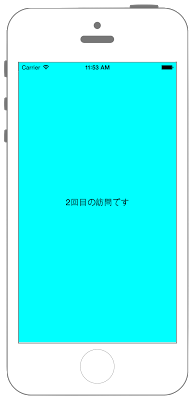

# NSUserDefaultsを用いたデータ保存



## Swift3.0
### AppDelegate.swift
```swift
//
//  AppDelegate.swift
//  Utility012_3.0
//
//  Created by KimikoWatanabe on 2016/08/24.
//  Copyright © 2016年 FaBo, Inc. All rights reserved.
//

import UIKit

@UIApplicationMain
class AppDelegate: UIResponder, UIApplicationDelegate {

    var window: UIWindow?
    var myUserDafault:UserDefaults = UserDefaults()

    func application(_ application: UIApplication, didFinishLaunchingWithOptions launchOptions: [NSObject: AnyObject]?) -> Bool {
        // Override point for customization after application launch.

        //登録されているUserDefaultに+1する
        let count:Int = myUserDafault.integer(forKey: "VisitCount") + 1

        //+1した値を登録する
        myUserDafault.set(count, forKey: "VisitCount")

        return true
    }
}

```
### ViewController.swift
```swift
//
//  ViewController.swift
//  Utility012_3.0
//
//  Created by KimikoWatanabe on 2016/08/24.
//  Copyright © 2016年 FaBo, Inc. All rights reserved.
//

import UIKit

class ViewController: UIViewController {

    override func viewDidLoad() {

        super.viewDidLoad()

        // 背景を青色に設定.
        self.view.backgroundColor = UIColor.cyan

        //UserDefaultの生成.
        let myUserDafault:UserDefaults = UserDefaults()

        //登録されているUserDefaultから訪問数を呼び出す.
        let count:Int = myUserDafault.integer(forKey: "VisitCount")

        //取り出した訪問数を表示するためのUILabel.
        let myLabel:UILabel = UILabel()

        myLabel.text = "\(count)回目の訪問です"

        myLabel.sizeToFit()

        myLabel.center = CGPoint(x: self.view.frame.width/2, y: self.view.frame.height/2)

        self.view.addSubview(myLabel)

    }
}
```

## Swift 2.3
### AppDelegate.swift
```swift
//
//  AppDelegate.swift
//  Utility012_2.3
//
//  Created by KimikoWatanabe on 2016/08/24.
//  Copyright © 2016年 FaBo, Inc. All rights reserved.
//

import UIKit

@UIApplicationMain
class AppDelegate: UIResponder, UIApplicationDelegate {

    var window: UIWindow?
    var myUserDafault:NSUserDefaults = NSUserDefaults()

    func application(application: UIApplication, didFinishLaunchingWithOptions launchOptions: [NSObject: AnyObject]?) -> Bool {
        // Override point for customization after application launch.

        //登録されているUserDefaultに+1する
        let count:Int = myUserDafault.integerForKey("VisitCount") + 1

        //+1した値を登録する
        myUserDafault.setObject(count, forKey: "VisitCount")

        return true
    }
}

```
### ViewController.swift
```swift
//
//  ViewController.swift
//  Utility012_2.3
//
//  Created by KimikoWatanabe on 2016/08/24.
//  Copyright © 2016年 FaBo, Inc. All rights reserved.
//

import UIKit

class ViewController: UIViewController {

    override func viewDidLoad() {

        super.viewDidLoad()

        // 背景を青色に設定.
        self.view.backgroundColor = UIColor.cyanColor()

        //UserDefaultの生成.
        let myUserDafault:NSUserDefaults = NSUserDefaults()

        //登録されているUserDefaultから訪問数を呼び出す.
        let count:Int = myUserDafault.integerForKey("VisitCount")

        //取り出した訪問数を表示するためのUILabel.
        let myLabel:UILabel = UILabel()

        myLabel.text = "\(count)回目の訪問です"

        myLabel.sizeToFit()

        myLabel.center = CGPoint(x: self.view.frame.width/2, y: self.view.frame.height/2)

        self.view.addSubview(myLabel)

    }
}
```

## 2.3と3.0の差分
* UIColorの参照方法が変更(UIColor.grayColor()->UIColor.gray)
* CGRect,CGPointの初期化方法の変更(CGRectMake,CGPointMakeの廃止)
* NSUserDefaultsの廃止、UserDefaultに変更

## Reference
* UserDefaults Class
 * [https://developer.apple.com/reference/foundation/userdefaults](https://developer.apple.com/reference/foundation/userdefaults)
